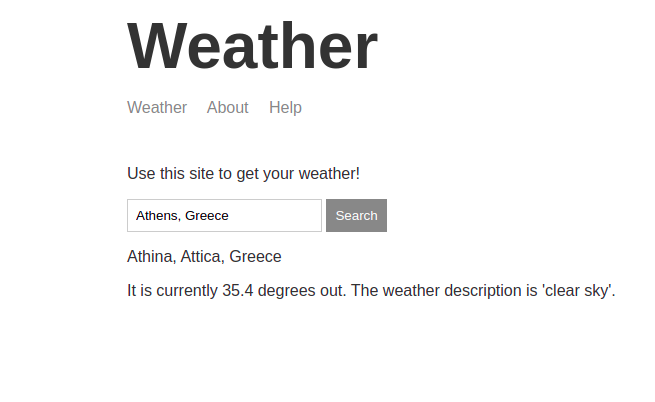

# Weather App

Search and find the current temperature in your city.  
Node.js is used for the backend development of this app.  
API: https://api.openweathermap.org/  
[Link to the Weather App](https://gkaf-weather-application.herokuapp.com/)
